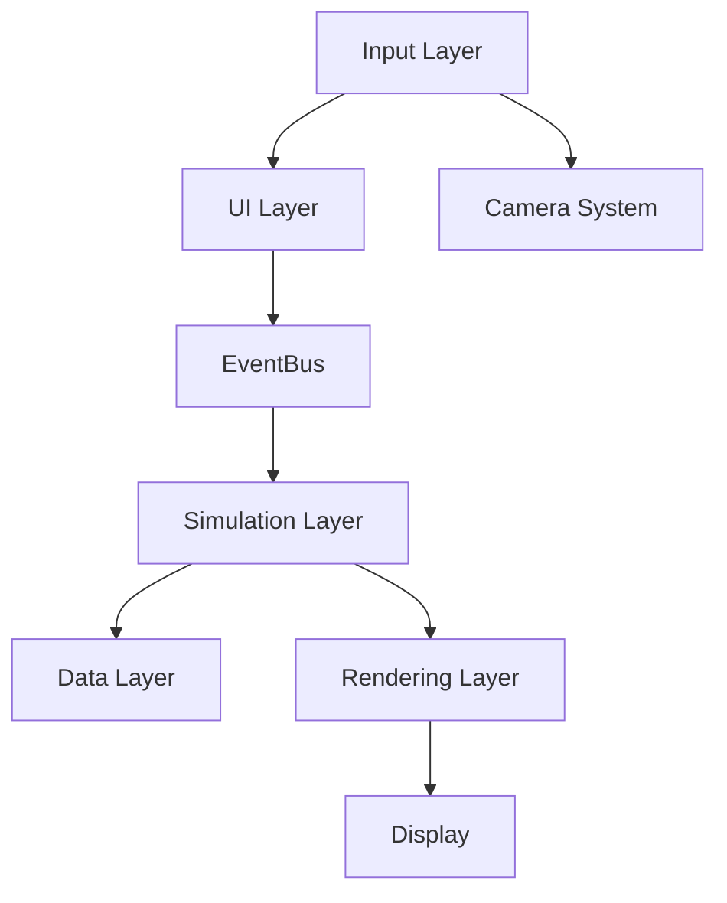

# Solar System Simulator - Technical Architecture

## 1. Overview

The **Solar System Simulator** is a high-performance, scientifically accurate real-time 3D simulation of the solar system. Built as a Single Page Application (SPA), it leverages **Three.js** for rendering and custom orbital mechanics engines to visualize celestial bodies from 1900 to 2100 with high precision.

The architecture emphasizes:
*   **Scientific Accuracy:** Hybrid propagator using JPL ephemerides and Keplerian physics.
*   **Performance:** Targeting stable 30-60 FPS on mid-range hardware.
*   **Modularity:** Decoupled simulation, rendering, and UI layers.
*   **Data-Driven Design:** All celestial body properties are configurable via JSON.
*   **Client-Side Execution:** Fully static deployment with no backend dependencies.

---

## 2. Technology Stack

### Core
*   **Language:** Vanilla JavaScript (ES6+)
*   **Runtime Environment:** Browser (WebGL 2.0 capable)
*   **Structure:** Modular ES Modules

### Rendering
*   **Engine:** [Three.js r182](https://threejs.org/)
*   **Post-Processing:** `EffectComposer` with `UnrealBloomPass` (for solar glow)
*   **Controls:** `OrbitControls` with custom damping and damping factors

### Physics & Math
*   **Ephemeris Data:** Custom compressed JSON derived from NASA JPL DE440
*   **Math Library:** Three.js `MathUtils` + custom orbital math helpers

### Build & Tooling
*   **Bundler:** [Vite](https://vitejs.dev/) (Fast HMR, optimized production builds)
*   **Package Manager:** npm
*   **Linting:** ESLint + Prettier

### Hosting
*   **Type:** Static Site Generation (SSG) / SPA
*   **Target:** Netlify, Vercel, or GitHub Pages

---

## 3. System Architecture Layers

The application is structured into six distinct layers to ensure separation of concerns:



1.  **External APIs/Data**: Raw data sources (NASA/JPL) processed into static JSON.
2.  **Data Layer**: Manages state, loading, and caching of celestial data using `EphemerisService`.
3.  **Simulation Layer**: The "brain" of the app. Handles time progression (game loop), orbital calculations, and physics updates.
4.  **Rendering Layer**: The "visuals". Visualizes the state provided by the Simulation Layer using Three.js meshes, lights, and materials.
5.  **UI Layer**: HTML/CSS overlays for HUD, information panels, and controls.
6.  **Input Layer**: Interprets user actions (clicks, drags, scrolls) into commands for Camera or Simulation.

---

## 4. Core Modules

### 4.1. Data Layer
Responsible for static asset loading and state management.
*   **`BodyDataStore`**: Singleton containing properities (mass, radius, texture paths) for all bodies.
*   **`EphemerisService`**: Fetches and parses orbital data.
*   **`AssetLoader`**: Manages asynchronous loading of textures and models with progress tracking.
*   **`CacheManager`**: Handles caching of heavy assets to improve subsequent loads.

### 4.2. Simulation Layer
Controls the logical state of the universe.
*   **`SimulationClock`**: The master clock. Controls game time, time scale (multiplier), and pause/resume states.
*   **`SolarSystemModel`**: The root container for all logical bodies.
*   **`OrbitalMechanics`**: Stateless utility library for calculating positions (Keplerian/Cartesian).
*   **`PositionUpdater`**: Runs every frame to update coordinates based on the `SimulationClock`.

### 4.3. Rendering Layer
Visual representation of the simulation.
*   **`SceneManager`**: Initializes Three.js scene, camera, and renderer.
*   **`BodyRenderer`**: Factory for creating planetary meshes (SphereGeometry + MeshStandardMaterial).
*   **`OrbitRenderer`**: Draws orbital paths using `LineBasicMaterial` or `CatmullRomCurve3`.
*   **`StarfieldRenderer`**: Generates background stars (PointsMaterial).
*   **`PostFX`**: Manages the post-processing chain (Bloom, Tone Mapping).

### 4.4. UI Layer
DOM-based user interface.
*   **`HUDController`**: Manages the heads-up display (time, speed).
*   **`TimelineController`**: Handles the interactive time scrubber.
*   **`BodySelector`**: Dropdown/Menu for rapid navigation.
*   **`InfoPanel`**: Displays detailed scientific data for the selected object.
*   **`SplashScreen`**: Loading screen with facts and progress bar.

### 4.5. Input Layer
*   **`CameraController`**: Wrapper around `OrbitControls`. Handles custom fly-to animations using Tween libraries (e.g., GSAP).
*   **`Raycaster`**: Detects mouse interactions with 3D objects.
*   **`EventBus`**: A central pub/sub system for cross-module communication (e.g., `BODY_SELECTED`, `TIME_CHANGED`).

---

## 5. Rendering Pipeline

The simulation loop follows a strict execution order to ensure consistency:

1.  **`requestAnimationFrame`**: Browser trigger.
2.  **`SimulationClock.tick()`**: Calculate `deltaTime` and update simulation time.
3.  **`SolarSystemModel.update()`**: Calculate new positions for all bodies based on the new time.
4.  **`SceneManager.update()`**: Sync Three.js meshes to the new logical positions.
    *   Rotate bodies (axial tilt + spin).
    *   Update LODs (if applicable).
    *   Update orbit lines (if dynamic).
5.  **`Composer.render()`**: Draw the scene to the canvas.
    *   Render base scene.
    *   Apply Bloom pass.
6.  **`UI.update()`**: Update HTML elements (dates, labels) if needed.

**Performance Target:** 30–60 FPS.

---

## 6. Scene Graph Structure

The Three.js scene hierarchy is organized to simplify transformations:

```text
Scene root
 ├── AmbientLight
 ├── PointLight (The Sun)
 ├── Starfield (Points)
 ├── SolarSystemGroup (Object3D)
 │    ├── Sun (Mesh)
 │    │    └── Glow (Sprite/Mesh)
 │    ├── MercuryGroup
 │    │    ├── Mercury (Mesh)
 │    │    └── OrbitLine (Line)
 │    ├── EarthGroup
 │    │    ├── Earth (Mesh)
 │    │    ├── Atmosphere (Mesh)
 │    │    ├── MoonGroup
 │    │    │    ├── Moon (Mesh)
 │    │    │    └── MoonOrbit (Line)
 │    │    └── EarthOrbit (Line)
 │    └── ... (Other Planets)
 └── Camera
```

*Note: Grouping allows for local coordinate systems (e.g., Moon orbits Earth, Earth orbits Sun).*

---

## 7. Orbital Mechanics System

The system uses a **Hybrid Propagation Strategy** to balance accuracy and performance.

### Mode 1: High-Precision (JPL Ephemeris)
*   **Range:** 1900 – 2100.
*   **Source:** Pre-computed tables from NASA's DE440.
*   **Method:** Cubic Spline Interpolation of daily/hourly state vectors.
*   **Accuracy:** < 0.01% error relative to Horizons.

### Mode 2: Analytic Approximation (Keplerian)
*   **Range:** Outside 1900–2100.
*   **Method:** Solving **Kepler's Equation** ($M = E - e \sin E$) iteratively.
*   **Parameters:** Orbital elements (Semimajor axis, eccentricity, inclination, etc.) stored in `bodies.json`.
*   **Use Case:** Fallback for extreme dates or minor bodies where ephemeris is too heavy.

---

## 8. Data-Driven Design

All celestial definitions are decoupled from code and stored in configuration files.

**`bodies.json` Schema Example:**
```json
{
  "id": "earth",
  "name": "Earth",
  "type": "planet",
  "radius": 6371,
  "texture": "assets/textures/earth_diffuse_2k.jpg",
  "orbit": {
    "a": 1.00000011,
    "e": 0.01671022,
    "i": 0.00005,
    "period": 365.25
  },
  "facts": [
    "The only planet known to support life.",
    "Water covers 70% of the surface."
  ]
}
```

This allows new bodies (asteroids, comets) to be added by simply editing the JSON file.

---

## 9. Camera System

The camera system is designed for "Cinematic Exploration".

*   **Controllers:** `OrbitControls` with restricted polar angles to prevent "upside down" viewing.
*   **Fly-To Animation:** When a user selects a body:
    1.  Calculate target position (with offset for best viewing angle).
    2.  Use GSAP/Tweening to interpolate Camera Position and Controls Target.
    3.  Smoothly ease in/out over 1.5–2.5 seconds.
*   **Follow Mode:** Optional lock that updates camera position every frame to match the target body's orbital velocity.

---

## 10. Performance Optimization

To maintain high FPS on mid-range devices:

1.  **InstancedMesh:** Used for the Asteroid Belt (thousands of rocks rendered in one draw call).
2.  **Texture Management:**
    *   Use power-of-two textures (2048x1024).
    *   Compress textures (WebP/JPG) and use lazy loading.
3.  **Frustum Culling:** Three.js default engine automatically culls objects outside the camera view.
4.  **Logarithmic Depth Buffer:** Enabled to prevent z-fighting between near objects (moons) and far objects (outer planets).
5.  **Raycasting Throttle:** Mouse move raycasting is throttled to 10-20 times per second rather than every frame.

---

## 11. Asset Pipeline

*   **Location:** `/public/assets/`
*   **Structure:**
    *   `/textures/` (Surface maps)
    *   `/data/` (Ephemeris JSONs)
    *   `/icons/` (UI elements)
*   **Strategy:** Progressive Loading.
    1.  Load Critical Path (Sun, Earth, UI).
    2.  Show Simulation.
    3.  Background load remaining planets and 4K textures.

---

## 12. Key Architecture Pattern

**Event-Driven Communication**

To decouple the UI from the Simulation, the app uses an `EventBus`.

*   **User Action:** User clicks "Mars" in UI.
*   **Event:** UI fires `SimulationEvents.SELECT_BODY` with payload `{ id: 'mars' }`.
*   **Listeners:**
    *   `CameraController`: Starts flight to Mars.
    *   `InfoPanel`: slideshows Mars data.
    *   `SceneManager`: Highlights Mars mesh.

This prevents spaghetti code where UI widgets directly manipulate the 3D scene.